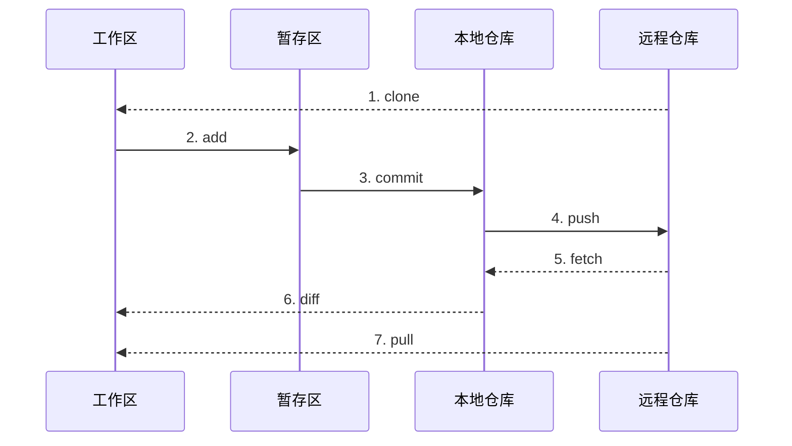

## Git 工作流



1. `clone` 将远程仓库的文件复制到本地。
2. `add` 将我们修改后的文件添加到暂存区。
3. 我们认为暂存区没问题后通过 `commit` 提交到本地仓库。
4. `push` 将本地仓库的内容更新到远程仓库。
5. `fetch` 将远程仓库的内容更新到本地仓库。
6. `fetch` 后使用 `diff` 对比区别两者差异，没问题后合并。
7. `pull` 直接将远程仓库的内容更新到工作区。

## Git 基础指令

### 1. 用户设置

设置 username

```Nginx
$ git config --global user.name "user name"
```

设置 email

```Nginx
$ git config --global user.email "abcd@gmail.com"
```

设置初始分支名

```nginx
$ git config --global init.defaultBranch main
```

### 2. 在当前目录下初始化 `git` 管理

```Nginx
$ git init
Initialized empty Git repository in X:/xxx/.git/
```

### 3. 查看状态

```nginx
$ git status
On branch master

No commits yet

Untracked files:
(use "git add <file>..." to include in what will be committed)
temp.md

nothing added to commit but untracked files present (use "git add" to track)
```

### 4. 添加文件到暂存区

```nginx
$ git add temp.md
```

### 5. 提交暂存区文件到本地仓库

```nginx
$ git commit -m "commit message"
[master (root-commit) 4b259ca] 版本 1
 1 file changed, 1 insertion(+)
 create mode 100644 temp.md
```

### 6. 查看 `git` 记录

```nginx
$ git log
commit 4b259ca3e88ac32ffb2774f509526769224e4c2c (HEAD -> master)
Author: Adam <adam.bx.meng@gmail.com>
Date:   Thu Apr 18 23:18:35 2024 +0800

    版本 1
```

### 7. 查看所有分支

```nginx
$ git branch
* main
```

### 8. 创建新分支

```nginx
$ git branch bad-boy
```

### 9. 切换分支

```nginx
$ git checkout bad-boy
Switched to branch 'bad-boy'
```

### 10. 删除分支

```nginx
$ git branch -d bad-boy # 使用 -D 来强制删除分支
Deleted branch bad-boy (was baac2ba).
```

### 11. 合并分支

```nginx
$ git merge temp
Updating baac2ba..2eebd82
Fast-forward
 README.md                 |   2 +
 content/docs/git/basic.md | 145 ++++++++++++++++++++++++++++++++++++++++++++--
 hugo_stats.json           |  36 +++++++++++-
 3 files changed, 176 insertions(+), 7 deletions(-)
```

### 12. 改变当前分支名称

```nginx
$ git branch -m main # -M 强制执行
```

## GitHub

### 1. 查看本地仓库与远程仓库的联系

```nginx
$ git remote -v
origin  https://github.com/xxx/blog-source.git (fetch)
origin  https://github.com/xxx/blog-source.git (push)
```

### 2. 与远程仓库联系

```nginx
# add <别名> <仓库地址>
$ git remote add origin https://github.com/xxx/blog-source
```

### 3. 同步远程仓库的内容到本地

```nginx
$ git pull origin main
```


如果远程仓库与本地仓库的提交历史不同，我们可以使用变基。`rebase` 会让我们本地的提交变为最新的一次提交记录，而将远程仓库的提交记录记录为之前的提交。

```nginx
$ git pull --rebase origin main
```



## 合并 Git 操作

### 1. 合并 `add` 与 `commit`

```nginx
$ git commit -am "new"
[new 1a7e8f3] new
 3 files changed, 167 insertions(+), 7 deletions(-)
```

### 2. 创建分支并切换过去

```nginx
$ git checkout -b temp
Switched to a new branch 'temp'
```

<script type="module">
  import mermaid from 'https://cdn.jsdelivr.net/npm/mermaid@10/dist/mermaid.esm.min.mjs';
  mermaid.initialize({ startOnLoad: true });
</script>
