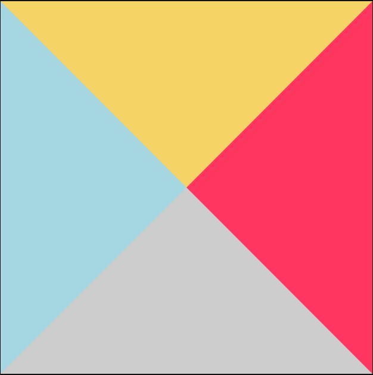

### 1. border

CSS 边框是由上下左右四个方向共同合成的一个框，当盒子长宽为 0 时，它的表现是如何呢？

```html
<div class="div1"></div>
```

```css
.div1 {
  width: 0;
  height: 0;
  background-color: #64c4ed;
  border-top: 250px solid #f6d365;
  border-left: 250px solid #a4d7e1;
  border-right: 250px solid #ed1250;
  border-bottom: 250px solid #414141;
}
```

`div1` 的表现如下：



此时我们可以隐藏其中的三个边框，只让一个边框显示。就可以做到绘制一个三角形了:

```css
.div1 {
  width: 0;
  height: 0;
  border-top: 250px solid transparent; # 设置透明度
  border-left: 250px solid transparent;
  border-right: 250px solid transparent;
  border-bottom: 250px solid #1d72a6;
}
```
