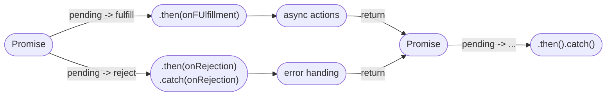

### 1. 介绍

`Promise` 意为承诺，是异步编程的一种解决方案，比传统的回调函数更合理、强大。

在以前处理多层异步操作时，我们通常会这样编写代码：

```JavaScript
doSomething(function(result) {
   doSomethingElse(result, function(newResult) {
      doThridThing(newResult, function(finalResult) {
         console.log("得到最终结果: " + finalResult);
      }, failureCallback);
   }, failureCallback);
}, failureCallback);
```

上面的代码阅读困难，这就是经典的回调地狱。

现在通过 `Promise` 改写上方代码：

```JavaScript
doSomething().then((result) => {
   return doSomethingElse(result);
}).then((newResult) => {
   return doThirdThing(newResult);
}).then((finalResult) => {
   console.log("得到最终结果: " + finalResult);
}).catch(failureCallback);
```

我们在这里就能体会到 `Promise` 解决异步操作时的优点了：

- 链式操作降低了编码难度
- 代码可读性增加

##### 下面我们来正式介绍下 `Promise`：

`Promise` 对象是一个构造函数，用来生成 `Promise` 实例

```javascript
const promise = new Promise((resolve, reject) => {});
```

**`Promise` 对象有且仅有三种状态**：

- `pending` 进行中
- `fulfilled` 已成功
- `rejected` 已失效

`Promise` 构造函数接受一个函数作为参数，该函数的两个参数分别是 `resolve` 和 reject，它们也都是函数。`Promise` 状态的改变是通过 `resolve()` 和 `reject()` 两个函数来实现的，可以在异步操作结束后调用这两个函数改变 `Promise` 实例的状态。

- `resolve` 函数用于将 `Promise` 对象的状态从 `pending` 转为 fulfilled。
- `reject` 函数用于将 `Promise` 对象的状态从 `pending` 转为 rejected。
  `Promise` 对象的状态不受外界影响，只有异步操作的结果可以决定当前处于哪一种状态。

当把一个任务交给 `Promise` 时，它的状态就是 `pending`，任务完成时转为 `fulfilled`，失败时转为 `rejected`。当状态发生过转换后，之后状态不会再次改变，且任何时候我们都可以得到这个结果。这与事件不同，事件的特点是当我们错过后，是无法得到结果的。

> 简单来说的话，`Promise` 就是一个容器，里面保存着某个未来才会结束的任务（通常为一个异步操作）的结果。`Promise` 提供统一的 API，各种异步操作都可以用同样的方法进行处理。
>
> 我们无法取消 `Promise`，一旦创建，它就会立即执行，无法中途取消，如果不设置回调函数，`Promise` 内部抛出的错误不会反映到外部，当处于 `pending` 状态时，无法得知目前进展到哪一阶段（刚刚开始还是即将结束）

阅读下图我们能轻松了解 `Promise` 的工作流程：



### 2. 实例方法

**我们常用的 `Promise` 实例方法有以下几种**：

###### 1. then

`then` 是实例状态发生改变时的回调函数，它可以为两个状态的改变注册回调函数，这个回调函数属于微任务，会在本轮事件循环的末尾进行。第一个参数是 `resolved` 状态的回调函数，第二个参数是 `rejected` 状态的回调函数。

`then` 方法返回的是一个新的 `Promise` 实例，这也是 `Promise` 能够链式书写的原因。

```JavaScript
getJSON("/post.json").then((json) => {
   return json.post;
}).then((post) => {
   // ...
});
```

###### 2. catch

`catch()` 是 `.then(null, rejection)` 或 `.then(undefined, rejection)` 的另一种写法，用于指定发生错误时的回调函数。

```JavaScript
getJSON("/posts.json").then((posts) => {
   // ...
}).catch((error) => {
   console.log("发生错误！", error);
});
```

`Promise` 对象的错误具有“冒泡”性质，它会一直向后传递，直到被捕获为止。

```JavaScript
getJSON("/post/1.json").then((post) => {
   return getJSON(post.commentURL);
}).then((comments) => {
   // some code
}).catch((error) => {
   // 处理前面三个 Promise 产生的错误
})
```

一般来说，我们使用 `then` 时往往只有一个参数，这是因为我们可以用 `catch` 方法代替 `then` 的第二个参数。

`Promise` 对象抛出的错误不会传递到外层代码，即不会有任何反应；

```JavaScript
const someAsyncThing = () => {
   return new Promise((resolve, reject) => {
      resolve(x + 2); // Reference Error: x is not defined
   })
}
```

这里的代码会抛出错误，但是并不会中断进程。因为 `Promise` 内部的错误不会影响到外部环境。

`catch` 方法之中还能再抛出错误，通过后面的 `catch` 去捕获。

###### 3. finally

`finally` 方法用于指定不管 `Promise` 对象最后状态如何，都要执行的代码段：

```JavaScript
promise.then((result) => {...})
.catch((error) => {...})
.finally(() => {...})
```

### 3. 构造函数方法

###### 1. all

`Promise.all()` 用于将多个 `Promise` 包装成一个新的 `Promise` 实例。

```JavaScript
const promise = Promise.all([p1, p2, p3]);
```

它接受一个数组（迭代对象）作为参数，数组成员都应该是 `Promise` 实例。

实例 `Promise` 的状态由 `p1`、`p2`、`p3` 共同决定，分为两种情况：

- 只有 `p1`、`p2`、`p3` 的状态都变为 `fulfilled`，`Promise` 实例的状态才会变成 `fulfilled`，此时 `p1`、`p2`、`p3` 的返回值组成一个数组传递给 `Promise` 的回调函数。
- 只要 `p1`、`p2`、`p3` 之中有一个被 `rejected`，`Promise` 的状态就变成 `rejected`。此时第一个被 `rejected` 的实例的返回值会被传递给 `Promise` 的回调函数。


注意，如果作为参数的 `Promise` 实例自己定义了 `catch` 方法，那么它一旦被 `rejected`，并不会出发 `Promise.all` 的 `catch` 方法。


```JavaScript
const p1 = new Promise((resolve, reject) => {
   resolve("hello");
}).then((result) => {
   console.log("p1 result: ", result);
   return result;
})
.catch((e) => {
   console.log("p1 catch: ", e);
   return e;
});

const p2 = new Promise((resolve, reject) => {
   throw new Error("报错");
}).then((result) => {
   console.log("p2 result: ", result);
   return result;
})
.catch((e) => {
   console.log("p2 catch: ", e);
   return e;
});

const p3 = Promise.all([p1, p2]).then((result) => {
   console.log(result); // ["hello", Error: 报错]
}).catch((e) => console.log(e));
```

如果 `p2` 没有自己的 `catch` 方法，就会调用 `Promise.all` 的 `catch`。

```JavaScript
const p1 = new Promise((resolve, reject) => {
   resolve("hello");
}).then((result) => result);

const p2 = new Promise((resolve, reject) => {
   throw new Error("报错");
}).then((result) => result);

Promise.all([p1, p2])
   .then((result) => console.log(result))
   .catch((e) => console.log(e)); // Error: 报错
```

###### 2. race

`Promise.race()` 同样是将多个 `Promise` 实例包装成一个新的 `Promise` 实例。

```JavaScript
const p = Promise.race([p1, p2, p3]);
```

只要 `p1`、`p2`、`p3` 之中有一个实例的状态发生了改变，`p` 的状态就会随之改变。率先改变的 `Promise` 实例的返回值会传递给 `p` 的回调函数。

```JavaScript
const p = Promise.race([
   fetch("/resource-that-may-take-a-while"),
   new Promise((resolve, reject) => {
      setTimeout(() => reject(new Error("request timeout")), 5000)
   })
]);

p.then(console.log).catch(console.error);
```

###### 3. allSettled

`Promise.allSettled()` 也是接受一组 `Promise` 实例作为参数包装成一个新的 `Promise` 实例。

```JavaScript
const promise1 = Promise.resolve(3);
const promise2 = new Promise((resolve, reject) => {
   setTimeout(reject, 100);
});
const promises = [promise1, promise2];

Promise.allSettled([promise1, promise2]).then((results) => {
   results.forEach((result) => console.log(result.status));
});

// 输出
// fulfilled
// rejected
```

只有等这些参数实例都返回结果，不管是 `fulfilled` 还是 `rejected`，包装实例才会结束。

###### 4. resolve

`Promise.resolve()` 将现有对象转为 Promise 对象。

```JavaScript
Promise.resolve("foo");
// 等价于
new Promise((resolve) => resolve("foo"));
```

参数可分为四种情况：

- 参数是一个 `Promise` 实例，`Promise.resolve` 将不做任何修改，原封不动的返回这个实例。
- 参数是一个 `thenable` 对象，`Promise.resolve` 会将这个对象转为 `Promise` 对象然后立即执行 `thenable` 对象的 `then` 方法。
- 参数不是具有 `then` 方法的对象，或根本不是对象，`Promise.resolve` 会返回一个新的 `Promise` 对象，状态为 `resolved`
- 没有参数时直接返回一个 `resolved` 状态的 `Promise` 对象。

###### 5. reject

`Promise.reject()` 返回一个新的 `Promise` 实例，该实例的状态为 `rejectd。`

```JavaScript
const p = Promise.reject("出错");
// 等价于
const p = new Promise((resolve, reject) => reject("出错"));

p.then(null, (s) => console.log(s)); // 出错
```

`Promise.reject()` 方法的参数会原封不动的变成后续方法的参数：

```JavaScript
Promise.reject("出错").catch((e) => {
   console.log(e === "出错"); // true
});
```

### 4. 使用场景

##### 1. 将图片的加载写成 Promise，一旦加载完成则状态发生改变

```JavaScript
const preloadImage = (path) => {
   return new Promise((resolve, reject) => {
      const image = new Image();
      image.onload = resolve;
      image.onerror = reject;
      image.src = path;
   });
};
```

##### 2. 通过链式操作将多个渲染数据分给不同的 then，让其各司其职。或当下一个异步请求依赖上个请求的结果时，也可以通过链式操作解决问题

```JavaScript
// 各司其职
getInfo().then((res) => {
   let { bannerList } = res;
   // 渲染轮播图
   console.log(bannerList);
   return res;
}).then((res) => {
   let { shortList } = res;
   // 渲染店铺列表
   console.log(shortList);
   return res;
}).then((res) => {
   let { categoryList } = res;
   // 渲染分类列表
   console.log(categoryList);
   return res;
});
```

##### 3. 通过 all 实现多个请求合并，汇总所有请求结果。比如加载 loading 时，只用设置一个 loading

```JavaScript
function initLoad() {
   loading.show() // 加载 loading
   Promise.all([getBannerList(), getStoreList(), getCategoryList()]).then((res) => {
      console.log(res);
      loading.hide(); // 关闭 loading
   }).catch((err) => {
      console.log(err);
      loading.hide(); // 关闭 loading
   })
}

initLoad(); // 数据初始化
```

##### 4. 通过 race 设置图片请求超时

```JavaScript
// 请求某个图片资源
function requestImg() {
   let p = new Promise((resolve, reject) => {
      let img = new Image();
      img.onload = function() {
         resolve(img);
      }
      // 正确的资源
      //img.src = "https://b-gold-cdn.xitu.io/v3/static/img/logo.a7995ad.svg";
      img.src = "https://b-gold-cdn.xitu.io/v3/static/img/logo.a7995ad.svg1";
   });
   return p;
}

// 延时函数，给请求计时
function timeout() {
   let p = new Promise((resolve, reject) => {
      setTimeout(() => {
         reject("图片请求超时");
      }, 5000);
   });
   return p;
}

Promise.race([requestImg(), timeout()]).then((results) => {
   console.log(results);
}).catch((err) => {
   console.log(err);
})
```

### 5. 面试回答

1. `Promise` 是异步编程的一种解决方案，目的是为了解决传统编写异步操作时的回调地狱问题。
2. `Promise` 的优点是链式操作降低了编码难度，代码可读性增加。
3. `Promise` 对象有且仅有三种状态：`pending`，`fulfilled`，`rejected`。
4. `Promise` 对象是一个构造函数，用于生成 `Promise` 实例。该函数的两个参数分别是 `resolve` 和 `reject`，这两个参数也都是函数。它们的作用是改变 `Promise` 的状态。`resolve` 可以将对象从 `pending` 转为 `resolved`，`reject` 将对象从 `pending` 转为 `rejected`。
5. `Promise` 的状态发生改变后，不会再次改变，且我们任何时候都可以得到这个结果。这与事件不同，事件的特点是错过后无法得到结果。
6. `Promise` 一旦创建就无法取消，如果我们不设置回调函数，`Promise` 内部抛出的错误不会反映到外部。
7. `Promise` 的实例方法有 `then`，`catch`，`finally`。
   - `then` 是实例状态发生改变时的回调函数，它属于微任务，会在本轮事件循环的末尾进行。它有两个参数，第一个参数是 `resolved` 状态的回调函数，第二个参数是 `rejected` 状态的回调函数。`then` 返回一个新的 `Promise` 实例，这也是 `Promise` 能够链式书写的原因。
   - `catch` 是 `.then(null, rejection)` 的简写，用于指定发生错误时的回调函数。`Promise` 对象的错误具有“冒泡”性质，它会一直往后传递直到被捕获为止。一般来说我们使用的 `then` 往往只有一个参数，这是因为我们可以用 `catch` 来代替第二个参数。`Promise` 抛出的错误不会传递到外部代码，即不会中断进程。
   - `finally` 用于指定不管 `Promise` 对象最后的状态如何都要执行的代码。
8. `Promise` 构造函数的方法有 `all`，`race`，`allSettled`，`resolve`，`reject`等。
   - `Promise.all()`，`Promise.race()`，`Promise.allSettled()` 都是将一组 `Promise` 实例作为参数包装成一个新的 `Promise` 实例。
   - 假设接受一个有三个 `Promise` 实例的数组
     - `Promise.all()` 是只有三个实例的状态都变为 `fulfilled`，返回的 `Promise` 实例的状态才会变成 `fulfilled`，此时三个实例的返回值作为一个数组传递给这个`Promise` 实例的回调函数；如果有一个被 `rejected`，则返回的 `Promise` 实例被 `rejected`，此时第一个被 `rejected` 的实例的返回值会被传递给 `Promise` 的回调函数。
     - `Promise.race()` 则是只要有一个实例的状态发生改变，则返回的 `Promise` 实例的状态就会随之改变，率先改变的实例的返回值会传递给 `Promise` 的回调函数。
     - `Promise.allSettled()` 则是要三个实例的状态都改变完成后，返回的 `Promise` 实例才会改变状态。且三个实例的返回值作为数组传给回调函数。

<script type="module">
   import mermaid from 'https://cdn.jsdelivr.net/npm/mermaid/dist/mermaid.esm.min.mjs';
   mermaid.initialize({ startOnLoad: true });
</script>
