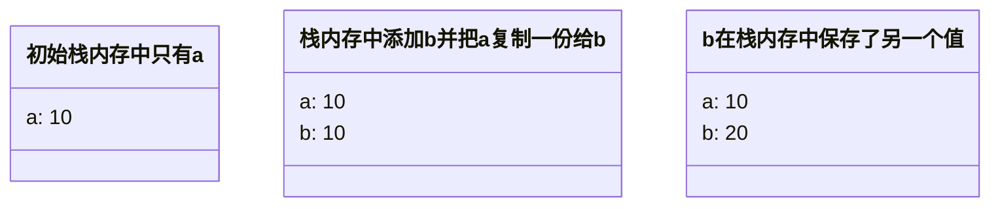

### 1. 前言

在 JavaScript 中，数据类型可以分为两种：

- 基本数据类型
- 复杂数据类型
  两者的区别在于存储的方式不同。

### 2. 基本类型

基本类型主要为以下七种：`Number`，`String`，`Boolean`，`Undefined`，`Null`，`Symbol`，`BigInt`。

###### Number

数值最常见的整数类型格式是十进制，还可以设置八进制或十六进制。

```JavaScript
let intNum = 55;  // 十进制的 55
let octNum = 070; // 八进制的 56
let hexNum = 0xA; // 十六进制的 10
```

浮点类型必须包含小数点，还可以通过科学技术法表示。

```JavaScript
let floatNum1 = 1.1;
let floatNujm2 = 3.125e7; // 31250000
```

在 `Number` 类型中存在一个特殊值 `NaN` - not a number。用于表示不是数值，即本来要返回熟知的操作失败了。

```JavaScript
console.log(0/0); // NaN
```

###### String

字符串可以用双引号、单引号或反引号表示。

```JavaScript
let name1 = "John";
let name2 = 'Jacob';
let name3 = `Jinx`;
```

字符串是不可变的，一旦创建就无法修改，对字符串的改变操作都是先销毁原字符串在创建一个新的字符串。

```JavaScript
let lang = "Java";
lang = lang + "Script"; // 先销毁在创建
```

###### Boolean

布尔值类型有两个字面量：`true` 和 `false`。

通过 `Boolean` 可以讲起他类型的数据转化为布尔值，规则如下：

| 数据类型  | 转换为 true            | 转换为 false |
| --------- | ---------------------- | ------------ |
| String    | 非空字符串             | ""           |
| Number    | 非零数值（包括无穷值） | 0、NaN       |
| Object    | 任意对象               | null         |
| Undefined | N/A（不存在）          | undefined    |

###### Undefined

`Undefined` 类型只有一个值：`undefined`。当声明一个变量但未初始化时，就相当于给变量赋予了 `undefined` 值。

```JavaScript
let a;
console.log(a === undefined); // true
```

未声明的变量和声明时未初始化的变量是有区别的：

```JavaScript
let message;          // 声明变量却未初始化，值为 undefined

console.log(message); // undefined
console.log(age);     // 没有声明过该变量，报错
```

###### Null

`Null` 类型同样只有一个值：`null`。逻辑上 `null` 表示不存在任何对象值，但是 `typeof` 会将其判定为 `"object"`。

只要目标位置的预期值是一个对象，但又没有关联的对象可用时就可以使用 `null`。

```JavaScript
let car = null;
console.log(typeof car); // object （因历史原因不是 null）
```

###### Symbol

`Symbol` 表示实例为唯一、不可变的数据类型。每个从 `Symbol()` 返回的 symbol 值都是唯一的，一个 symbol 值能作为对象属性的标识符。这是该数据类型存在的唯一目的。

```JavaScript
let symbol1 = Symbol();
let symbol2 = Symbol();
console.log(typeof symbol1);     // symbol
console.log(symbol1 == symbol2); // false
```

### 3. 引用类型

复杂数据类型统称为 `Object`，主要了解以下三种：`Object`、`Array`、`Function`。

###### Object

创建对象的常用方式为对象字面量表示法，属性名可以是字符串或数值：

```JavaScript
let person = {
  name: "Nicholas",
  age: 29,
  5: true
};
```

###### Array

数组是一组有序的数据。与其他语言不同的是，数组中的每个槽位可以存储任意类型的值，并且数组也是动态大小的。

```JavaScript
let colors = ["red", 2, {age: 20}];
colors.push(2);
```

###### Function

函数其实就是一个对象，每个函数都是 `Function` 的实例，`Function` 和其它引用类型一样也有属性和方法。

函数有着三种常见的表达方式：

```JavaScript
// 函数声明
function sum1 = (num1, num2) {
  return num1 + num2;
}

// 函数表达式
const sum2 = function(num1, num2) {
  return num1 + num2;
}

// 箭头函数
const sum3 = (num1, num2) => {
  return num1 + num2;
}
```

### 4. 存储区别

基本数据类型和引用数据类型在内存中的存储位置不同，**基本数据类型存储在栈中，引用数据类型存储在堆中**。

###### 基本数据类型

当我们把一个变量赋给另一个变量时，解析器首先要确认这个值是基本类型值还是引用类型值。下面举个例子：

```JavaScript
let a = 10;
let b = a; // 赋值操作
b = 20;
console.log(a); // 10
```

a 的值是基本数据类型，存储在栈中，将 a 的值赋给 b，虽然两个变量的值相等，但是两个变量保存了两个不同的内存地址。



###### 引用数据类型

引用类型数据存放在堆中，每个堆内存对象都有相应的引用地址指向它，而这个引用地址则存储在栈中。

```JavaScript
let obj1 = {};
let obj2 = obj1;
obj2.name = "TXP";
console.log(obj1); // TXP
```

obj1 是一个引用类型，在赋值操作时，实际上是复制了在栈内存储的指向堆内存的指针，所以它们共同指向了同一个堆内存对象，所以更改 obj2 会对 obj1 产生影响。

### 4. 面试回答

1. JavaScript 的数据类型分为两种：基本数据类型和引用数据类型。
2. 基本数据类型有：`Number`、`String`、`Boolean`、`Undefined`、`Null`、`Symbol`、`BigInt`。
3. 引用数据类型统称为 `Object`。我们又可以将其分成三小类：通常的 `Object`、`Function` 和 `Array`。
4. 基本数据类型存储在栈中，占据空间小、大小固定，属于被频繁使用的数据类型。
5. 引用数据类型存储在堆中，占据空间大、大小不固定，在栈中存储了指向它们内存起始地址的指针。当使用引用值时，会首先检索其在栈中的地址，取得地址后再从堆中获得实体。

<script type="module">
   import mermaid from 'https://cdn.jsdelivr.net/npm/mermaid/dist/mermaid.esm.min.mjs';
   mermaid.initialize({ startOnLoad: true });
</script>
